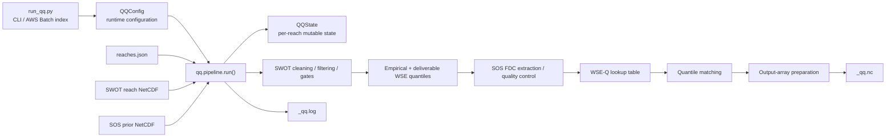
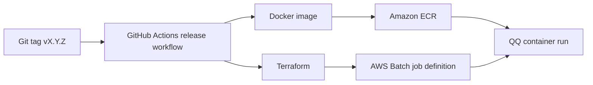

# QQ Architecture

## Scope

This document describes the software architecture of the SWOT-Confluence QQ discharge-estimation package.

The scientific method of the initial release is documented separately in
[`METHODOLOGY_v1.0.0.md`](METHODOLOGY_v1.0.0.md). Version 1.0.1 changes
documentation, package metadata, and software provenance; the core QQ
scientific algorithm remains the v1.0.0 method.

---

## 1. High-level architecture

QQ is a **single-reach package**, written for SWOT-Confluence pipeline. v1.0.0 is written as QQ is as a FLPE Algorithm within the pipeline. One invocation selects one reach from `reaches.json`, reads its SWOT observations and SOS flow-duration-curve
prior, performs quantile matching, and writes one QQ NetCDF product.



QQ does not use hydraulic-model calibration or channel-geometry parameters.
In the current implementation, the manifest `sword` field is resolved for
ecosystem compatibility, but the SWORD NetCDF is not read by the scientific
calculation in the v1.0.0 but will be used in future versions of QQ.

---

## 2. Package layers

### 2.1 Entry point and runtime configuration

**`run_qq.py`**

- parses CLI arguments;
- resolves the reach manifest and runtime paths;
- initializes logging;
- builds `QQConfig`;
- invokes `qq.pipeline.run()`;
- returns process exit status.

**`qq/config.py`**

Defines `QQConfig`, which contains runtime controls such as:

- input/output directories;
- manifest index;
- run mode (`RUN`, `DEBUG`, `AUDIT`);
- console/file logging;
- optional diagnostics.

Runtime configuration is deliberately separate from scientific constants.

---

### 2.2 Canonical project metadata and provenance

**`pyproject.toml`**

Canonical source for static package/project metadata:

- distribution name;
- release version;
- short description;
- authors/maintainers;
- project URLs;
- Python requirement;
- package dependencies.

**`qq/metadata.py`**

Runtime bridge to the installed package metadata plus execution provenance:

- package name/version/description;
- authors/maintainers;
- repository URL;
- UTC creation time;
- Git commit;
- Git describe/tag/dirty state.

Static metadata should not be redefined here.

**`.github/workflows/release.yml` + `Dockerfile`**

Inject Git release provenance into the production container, where the
repository `.git` directory is not expected to be available.

---

### 2.3 Scientific and ecosystem constants

**`qq/constants.py`**

Contains algorithmic, schema, flag, fill-value, variable-name and
probability-grid constants.

It should not be the authoritative source for package version, authorship,
project URLs or other project identity metadata.

---

### 2.4 Per-reach state and fault handling

**`qq/state.py`**

`QQState` is the mutable state object shared across pipeline stages. It holds:

- resolved input/output paths;
- read SWOT/SOS data;
- cleaned/filtered tables;
- empirical WSE quantiles;
- SOS FDC;
- lookup-table products;
- matched discharge;
- final output arrays;
- warnings/errors and invalid-reach codes.

**`qq/logger.py`**

Provides:

- structured logging;
- section/log helpers;
- warnings;
- fault-survival behavior;
- detailed-to-summary invalid-reach flag mapping.

In `RUN` and `AUDIT`, recoverable scientific/data failures are represented in
state and in the output NetCDF rather than necessarily terminating the process.
`DEBUG` raises failures immediately.

---

## 3. Input architecture

### `qq/input_json.py`

`setup_inputs_and_defaults()`

- creates safe state defaults;
- resolves logical input/output locations.

`read_json()`

- reads `reaches.json`;
- selects the configured zero-based index;
- extracts `reach_id`, SWOT, SOS and SWORD filenames;
- resolves per-reach paths.

### `qq/input_swot.py`

`read_swot()`

- opens the reach-level SWOT NetCDF;
- extracts required reach variables and NetCDF metadata;
- builds the SWOT DataFrame.

`clean_swot()`

- applies internal validity cleaning.

`filter_swot()`

- applies optional quality filtering such as the current `reach_q` criterion.

`control_wse_count()`

- applies the minimum clean/filtered observation gate.

### `qq/input_sos.py`

`read_sos()`

- locates the selected reach in the continental SOS prior file;
- reads probability and flow-duration discharge;
- converts probabilities to the internal non-exceedance convention;
- applies FDC quality gates;
- builds the reach FDC table.

---

## 4. Scientific transformation architecture

### `qq/wse_quantile.py`

`empirical_wse_quantile()`

- ranks retained WSE values;
- constructs the empirical WSE/non-exceedance-probability relation.

`deliverable_wse_quantile()`

- resamples the empirical relation to the standard probability grid.

`deliverable_wse_flag()`

- records whether the standardized WSE product represents upsampling,
  downsampling, equal-size sampling, or missing output.

### `qq/lookup_table.py`

`build_lookup_table()`

- determines the common empirical-WSE/SOS-FDC probability interval;
- builds the regular lookup probability grid;
- interpolates WSE and discharge on that overlap;
- does not extrapolate beyond the overlap.

The lookup table is an auxiliary deliverable and does not itself invalidate an
otherwise valid reach.

### `qq/quantile_matching.py`

`quantile_matching()`

Implements the core mapping:

```text
SWOT WSE
   ↓
empirical WSE non-exceedance probability
   ↓
SOS FDC at the same probability
   ↓
QQ discharge
```

With the current default configuration, discharge is estimated only within
the probability range supported by the SOS FDC.

### `qq/helpers.py`

Contains reusable low-level utilities for:

- NetCDF character/string conversion;
- NetCDF variable metadata extraction;
- fail-safe empty DataFrames;
- WSE-quantile interpolation/extrapolation;
- probability/value interpolation.

---

## 5. Output architecture

### `qq/output_arrays.py`

`prepare_output_arrays()`

Builds the final arrays and flags written to NetCDF, including:

- `QQ_time`;
- `QQ_q`;
- `QQ_q_status_flag`;
- standardized WSE quantiles;
- lookup-table arrays.

It also defines fail-safe arrays for invalid reaches.

### `qq/output_netcdf.py`

`output_paths()`

Creates the per-reach output and log paths.

`write_nc()`

Writes the complete NetCDF product for both valid and recoverably invalid
reaches.

Current logical structure:

```text
Root
├── QQ_time
├── QQ_invalid_reach_detailed_flag
├── QQ_invalid_reach_summary_flag
├── global dataset/software/provenance attributes
├── q/
│   ├── QQ_q
│   └── QQ_q_status_flag
├── wse_quantile/
│   ├── QQ_wse_quant_prob
│   ├── QQ_wse_quant_wse
│   └── QQ_wse_quant_flag
└── lookup_table/
    ├── QQ_lookup_table_prob
    ├── QQ_lookup_table_wse
    ├── QQ_lookup_table_q
    └── QQ_lookup_table_flag
```

Software provenance includes package version and Git information without
changing the scientific variable/group contract.

`save_log()`

Writes the accumulated run log unless disabled by runtime configuration.

### `qq/diagnostics.py`

Optional Plotly diagnostics. These products are not required by the production
scientific output contract.

---

## 6. Orchestration order

`qq.pipeline.run()` is the central orchestrator.

The current execution order is:

```text
1.  setup_inputs_and_defaults
2.  read_json
3.  read_swot
4.  clean_swot
5.  filter_swot
6.  control_wse_count
7.  empirical_wse_quantile
8.  deliverable_wse_quantile
9.  deliverable_wse_flag
10. read_sos
11. build_lookup_table
12. quantile_matching
13. prepare_output_arrays
14. prepare_plot_limits
15. output_paths
16. write_nc
17. make_plots
18. save_log
```

This ordering is part of the current implementation contract: later stages
consume state populated by earlier stages.

---

## 7. Repository architecture

```text
QQ/
├── qq/
│   ├── __init__.py
│   ├── metadata.py
│   ├── constants.py
│   ├── config.py
│   ├── state.py
│   ├── logger.py
│   ├── helpers.py
│   ├── input_json.py
│   ├── input_swot.py
│   ├── input_sos.py
│   ├── wse_quantile.py
│   ├── lookup_table.py
│   ├── quantile_matching.py
│   ├── output_arrays.py
│   ├── output_netcdf.py
│   ├── diagnostics.py
│   ├── pipeline.py
│
├── documentations/
│   ├── METHODOLOGY_v1.0.0.md
│   ├── VERSIONING.md
│   ├── CHANGELOG.md
│   ├── ARCHITECTURE.md
│
├── tests/
│
├── deploy/
├── terraform/
├── .github/workflows/
├── Dockerfile
├── requirements.txt
├── pyproject.toml
├── README.md
│
└── run_qq.py
```

---

## 8. Deployment architecture



The release workflow passes the release tag and Git commit into the Docker
build. `qq/metadata.py` reads these environment values in production so every
QQ NetCDF can retain the software provenance even when `.git` is absent from
the container.

---

## 9. Compatibility boundary

The stable downstream contract is primarily:

- CLI/input manifest expectations;
- per-reach output filename `<reach_id>_qq.nc`;
- NetCDF dimensions, groups and variables;
- fill values and flags;
- scientific meaning of the output variables.

Adding new global provenance attributes is backward-compatible for normal
NetCDF readers because existing groups and variables are unchanged.

Changes that rename/remove required inputs or outputs, change required
dimensions incompatibly, or fundamentally replace the scientific method should
be treated according to the repository versioning policy.
